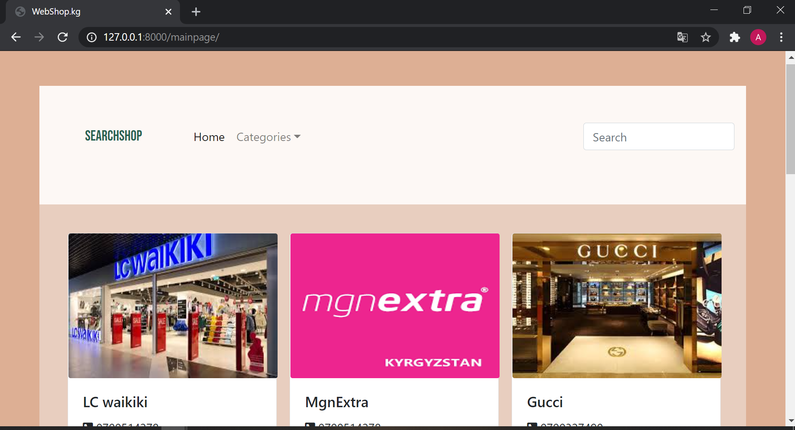
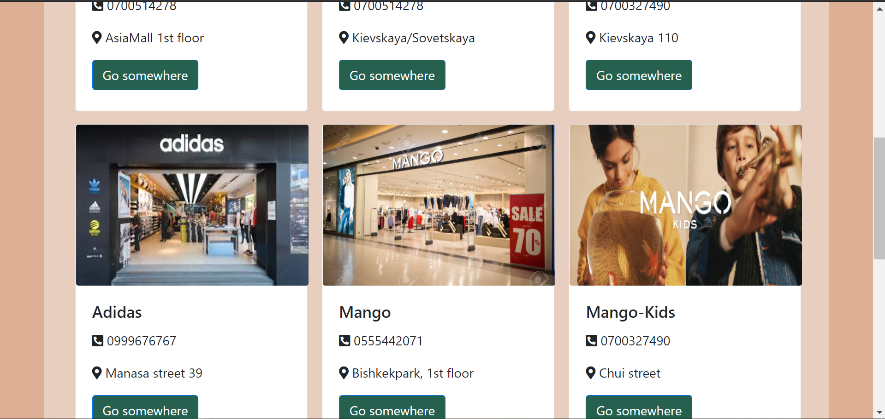
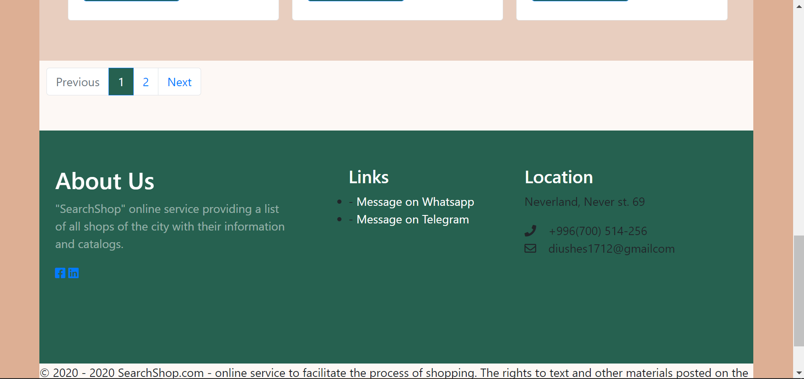
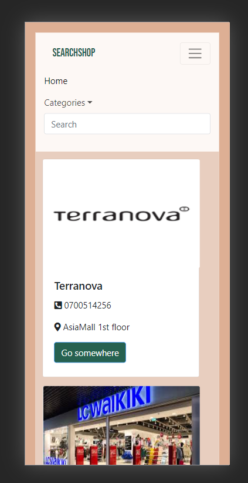
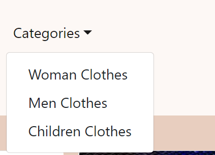
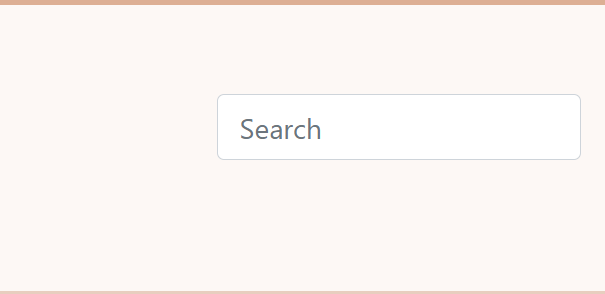

# webshop

## Title of the project
SearchShop

# Description
### A simple webisite designed to provide full information about shops in our city and their catalogs with available products and their photos.

# Screenshots

# Tools 
### Pycharm 
### HTML5, CSS, bootstrap4 (frontend)
### Django framework/python (backend) 

# Project Structure
### The frontend part of website consists of two templates : index.html and catalog.html

## Contact person
##### Name: Aiana
##### Surname: Diushenalieva
##### email: aiana.diushenalieva@iaau.edu.kg
##### phone: +996999251530

# Some Features:
## 1) Adaptive

## 2) Filtration of shops by categories

## 3) Simple and convenient search system

